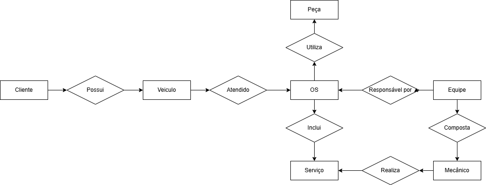

# 📌 Controle e Gerenciamento de Ordens de Serviço em Oficina Mecânica

## 📖 Descrição do Projeto
Este projeto consiste na criação de um esquema conceitual para um **Sistema de Controle e Gerenciamento de Ordens de Serviço** em uma oficina mecânica. O modelo visa organizar as informações sobre clientes, veículos, mecânicos e ordens de serviço, garantindo um fluxo eficiente no atendimento e na execução dos serviços prestados.

O esquema conceitual foi desenvolvido com base na narrativa fornecida e representa o funcionamento da oficina mecânica.

## 🎯 Objetivo
Criar um **esquema conceitual** que represente o funcionamento de uma oficina mecânica, abordando as principais interações entre clientes, veículos, ordens de serviço e mecânicos.

## 📝 Narrativa
- Clientes levam seus veículos à oficina para manutenção, seja por conserto ou revisão periódica.
- Cada veículo é designado a uma equipe de mecânicos, responsável por avaliar os serviços necessários e registrar uma **Ordem de Serviço (OS)**.
- A OS contém uma lista de serviços a serem executados, com base em uma tabela de referência de mão de obra.
- O custo da OS é calculado a partir da soma dos valores dos serviços e das peças utilizadas.
- O cliente autoriza a execução dos serviços antes da equipe iniciar os reparos.
- A equipe de mecânicos executa e avalia os serviços prestados.

## 🏗️ Esquema Conceitual
O diagrama conceitual pode ser visualizado no seguinte link:

